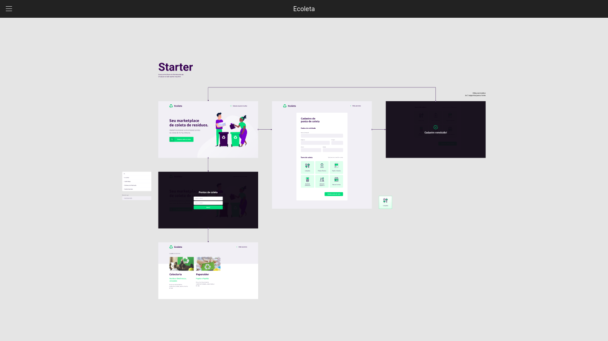

<h1 align="center">
  
  
</h1>

<h4 align="center"> 
	:recycle: Ecoleta 1.0 🚀
</h4>
<p align="center">
  

  
	
  <a href="https://www.linkedin.com/in/castelo-guilherme/">
    
  </a>
  

  <a href="https://github.com/castelogui/next-level-week/commits/master">
    
  </a>

  
   <a href="https://github.com/castelogui/next-level-week/stargazers">
    
  </a>
  <a href="https://github.com/castelogui/next-level-week/watchers">
    
  </a>
</p>

## :information_source: O que é a Next Level Week?

Um evento online e totalmente gratuito! Uma semana prática com muito código, desafios, networking com o único objetivo de nos levar para o próximo nível como desenvolvedor.

O método da rocketseat é baseado em 3 pilares: **Prática** diárias das tecnologias, **Foco** total no aprendizado e na construção da aplicação, interações em **Grupo** na comunidade da [Rocketseat](https://rocketseat.com.br/). 

## 💻 O Projeto

Ecoleta é um projeto desenvolvido com base na semana internacional do meio ambiente. O objetivo é conectar pessoas com as empresas que coletam resíduos específicos, como lâmpadas, baterias, óleo de cozinha etc.

<h1 align="center">
    
</h1>


## :rocket: Tecnologias

Este projeto foi desenvolvido comm as seguintes Tecnologias:

- [Node.js][nodejs]
- [TypeScript][typescript]
- [React][reactjs]
- [React Native][rn]
- [Expo][expo]

## 🔖 Layout

Para ter acesso ao layout [Figma](https://www.figma.com/file/1SxgOMojOB2zYT0Mdk28lB/?viewer=1&node-id=).

<h1 align="center">
    
</h1>

## :interrobang: Como usar

Para clonar e rodar esta aplicação, é preciso ter o [Git](https://git-scm.com), o [Node.js][nodejs] + [Yarn][yarn] instalado em seu computador.

Na linha de comando **como admnistrador**:

### Instalar API 

```bash
# Clonar esse repositório
$ git clone https://github.com/castelogui/next-level-week

# Navegue até o diretório
$ cd next-level-week/server

# Instale as dependencias necessárias
$ yarn install

# Execute o comando para rodar as Migrates
$ yarn knex:migrate

# Execute o comando para rodar os Seeds
$ yarn knex:seed

# Depois é preciso dar um start no server
$ yarn dev

# running on port 3333
```

### Instalar o Front-end

```bash
# Clonar esse repositório
$ git clone https://github.com/castelogui/next-level-week

# Navegue até o diretório
$ cd next-level-week/web

# Instale as dependências necessarias
$ yarn install

# Rode
$ yarn start

# running on port 3000
```

### Instalar o Mobile

```bash
# Clone esse repositório
$ git clone https://github.com/castelogui/next-level-week

# Navegue até o diretório
$ cd next-level-week/mobile

# Instale as dependências
$ yarn install

# Rode
$ yarn start

# Expo will open, just scan the qrcode on terminal or expo page

# Se houver problemas com as fontes, execute:
$ expo install expo-font @expo-google-fonts/ubuntu @expo-google-fonts/roboto

# Instale o expo em seu dispositivo móvel ou no emulador

```

## 🤔 Como contribuir

- Faça a *fork*;
- Crie uma *branch* de sua feature: `git checkout -b minha-alteracao`;
- Faça um *commit* de suas mudanças: `git commit -m 'mudanças: minha-alteração'`;
- De um *push* da sua branch: `git push origin minha-alteração`.

Depois de mesclar sua solicitação de *request*, você pode deletar a sua branch.

## :memo: License

Este projeto está sob a MIT License. Consulte [LICENSE](https://github.com/castelogui/next-level-week/blob/master/LICENSE) para mais detalhes.


Feito com todo o auxilio da comunidade [Rocketseat](https://discord.gg/JJsN5Mt) por Guilherme Castelo :wave: [Entre em contato!](https://www.linkedin.com/in/castelo-guilherme/)

[nodejs]: https://nodejs.org/
[typescript]: https://www.typescriptlang.org/
[expo]: https://expo.io/
[reactjs]: https://reactjs.org
[rn]: https://facebook.github.io/react-native/
[yarn]: https://yarnpkg.com/
[vs]: https://code.visualstudio.com/
[vceditconfig]: https://marketplace.visualstudio.com/items?itemName=EditorConfig.EditorConfig
[vceslint]: https://marketplace.visualstudio.com/items?itemName=dbaeumer.vscode-eslint
[prettier]: https://marketplace.visualstudio.com/items?itemName=esbenp.prettier-vscode
